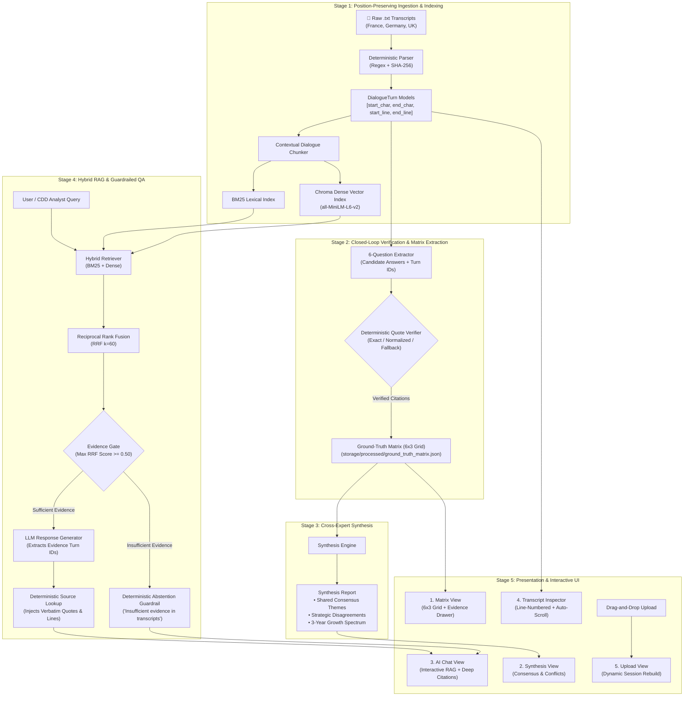
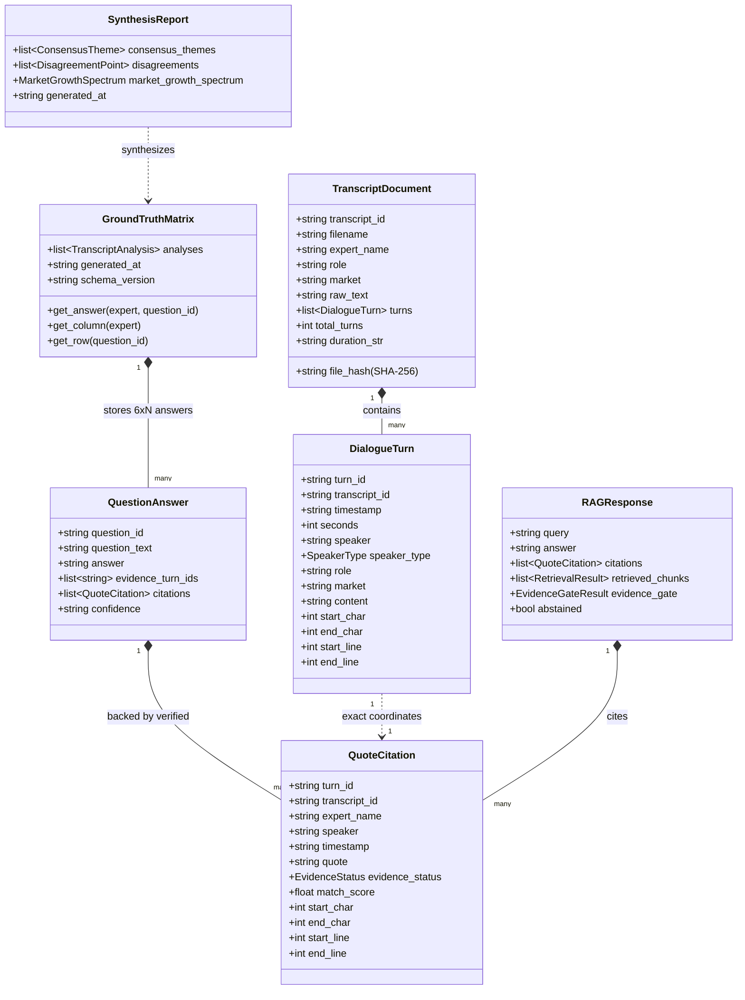

# Transcript Intelligence Pro — Hasamex AI Engineer Technical Case

A closed-loop qualitative document intelligence application for qualitative commercial due diligence on the European robotic surgery market.

---

## 1. Executive Summary & Core Capabilities

The application ingests timestamped expert transcripts across **France** (Dr. Jean Martin), **Germany** (Anna Keller), and the **UK** (Dr. Emily Carter), answers the 6 standardized interview-guide questions, verifies evidence against the original transcript source, synthesizes cross-expert themes and disagreements, and exposes a conversational RAG interface with deterministic citations.

---

## 2. System Architecture Diagram



---

## 3. Data Model & Schema Diagram



---

## 4. Evidence Contract & Closed-Loop Verification

The LLM does not define the final citation text. It returns `evidence_turn_ids`; the application resolves those IDs against the canonical `TranscriptDocument` and extracts the exact source quote, timestamp, and line/character provenance:

1. **`EXACT_VERIFIED` (Score: 1.00)**: Verbatim substring match `raw_text[start:end] == quote`.
2. **`NORMALIZED_VERIFIED` (Score: 0.95)**: Normalized match across smart quotes, dashes, whitespace, and punctuation.
3. **`FALLBACK_EVIDENCE` (Score: 0.85)**: Deterministic fuzzy recovery via `thefuzz` / Levenshtein distance.
4. **`REJECTED` (Score: 0.00)**: Candidate citation hallucinated or unsupported; rejected from verified citations.

---

## 5. Five-Screen Interactive Streamlit Application

1. **MATRIX** — Dynamic $6 \times 3$ comparative question matrix. Cached answers load with zero token spend; timestamp buttons open the Evidence Drawer.
2. **SYNTHESIS** — Shared Consensus Themes, Strategic Disagreements with stakeholder positions, and the 3-Year Market Growth Spectrum (Conservative, Moderate, Bullish).
3. **AI CHAT** — Hybrid RAG with Market/Role filtering, progressive streaming, evidence gate abstention, and expandable citation cards with 1-click line jump.
4. **INSPECTOR** — Complete line-numbered transcript viewer with speaker styling, `.line-target` highlighting on citation jump, and auto-scroll.
5. **UPLOAD** — Drag-and-drop `.txt` ingestion with metadata/timestamp validation, SHA-256 idempotency, and dynamic session rebuild (matrix extraction $\to$ synthesis $\to$ in-memory RAG index).

---

## 6. Main Codebase Structure

```text
src/
├── config.py               # Pydantic settings and environment management
├── models/
│   ├── transcript.py       # TranscriptDocument, Turn, SpeakerType, Metadata
│   ├── analysis.py         # QuestionAnswer, QuoteCitation, TranscriptAnalysis, GroundTruthMatrix
│   ├── synthesis.py        # ConsensusTheme, DisagreementPoint, MarketGrowthSpectrum, SynthesisReport
│   └── retrieval.py        # Chunk, RetrievalResult, EvidenceGateResult, RAGResponse
├── core/
│   ├── parser.py           # Position-preserving regex parser with SHA-256 idempotency
│   ├── quote_verifier.py   # Closed-loop deterministic citation verifier
│   ├── extractor.py        # 6-Question structured extractor with prompt versioning
│   ├── synthesizer.py      # Cross-expert synthesis engine
│   ├── chunker.py          # Turn-level provenance-preserving chunker
│   ├── embedder.py         # Sentence-Transformers (all-MiniLM-L6-v2) + deterministic hash embedder
│   ├── retriever.py        # BM25 + Vector + Reciprocal Rank Fusion (k=60) + Evidence Gate
│   └── rag_engine.py       # Conversational RAG engine with abstention guardrails
app/
└── streamlit_app.py        # 5-Screen interactive dashboard & Evidence Inspector
eval/
├── eval_dataset.json       # Canonical 8-case benchmark dataset
├── eval.py                 # Evaluation benchmark runner
└── evaluation_report.json  # Machine-readable evaluation report
scripts/
├── build_ground_truth.py   # CLI extraction utility
├── build_synthesis.py      # CLI cross-expert synthesis utility
└── build_rag_index.py      # CLI persistent Chroma indexing utility
tests/
├── test_parser.py          # 8 tests (42/42 turn offset invariant, speaker classification, SHA-256)
├── test_quote_verifier.py  # 7 tests (exact, normalized, multi-citation, hallucinated rejection)
├── test_extractor.py       # 5 tests (18-cell grid, cache invalidation, candidate turns)
├── test_synthesizer.py     # 6 tests (consensus themes, disagreements, growth spectrum)
├── test_rag.py             # 8 tests (turn chunking, hybrid retrieval, evidence gating, abstention)
├── test_phase6.py          # 2 tests (UI source availability, transcript counts)
└── test_phase7.py          # 2 tests (evaluation harness and deterministic offline scoring)
```

---

## 7. Local Setup & Quickstart

### Prerequisites
- Python 3.11+
- Windows PowerShell, macOS, or Linux

### 1. Create and Activate Virtual Environment

**Windows PowerShell**:
```powershell
python -m venv .venv
.\.venv\Scripts\Activate.ps1
```

**macOS / Linux**:
```bash
python3 -m venv .venv
source .venv/bin/activate
```

### 2. Install Dependencies
```bash
pip install -r requirements.txt
```

### 3. Environment Configuration
Copy `.env.example` to `.env`:
```powershell
cp .env.example .env
```
*(Optional: Provide `OPENAI_API_KEY` for live GPT-4o extractions; system defaults to deterministic offline mock/hash paths without credentials).*

---

## 8. Verification Commands

### Run Full Automated Test Suite (38 Tests)
```bash
pytest -v
```

### Run Evaluation Harness Benchmark
```bash
python eval/eval.py
```

### Launch Interactive Streamlit Pro Dashboard
```bash
streamlit run app/streamlit_app.py
```

---

## 9. Deep Dive Documentation & Architecture

For additional technical blueprints, benchmarks, and scaling discussions:
- [docs/ARCHITECTURE.md](docs/ARCHITECTURE.md) — Comprehensive System Architecture & Deep Pipeline Analysis
- [docs/SCALABILITY.md](docs/SCALABILITY.md) — Production Scale & Latency Optimization
- [docs/BENCHMARK_AND_REFERENCES.md](docs/BENCHMARK_AND_REFERENCES.md) — Literature & Industry Benchmark Grounding

---

## 10. Interview Demonstration & Presentation

See [`docs/INTERVIEW_DEMO_SCRIPT.md`](docs/INTERVIEW_DEMO_SCRIPT.md) for a complete 5–10 minute live walkthrough guide with minute-by-minute talking points, UI navigation steps, and production scaling answers.
