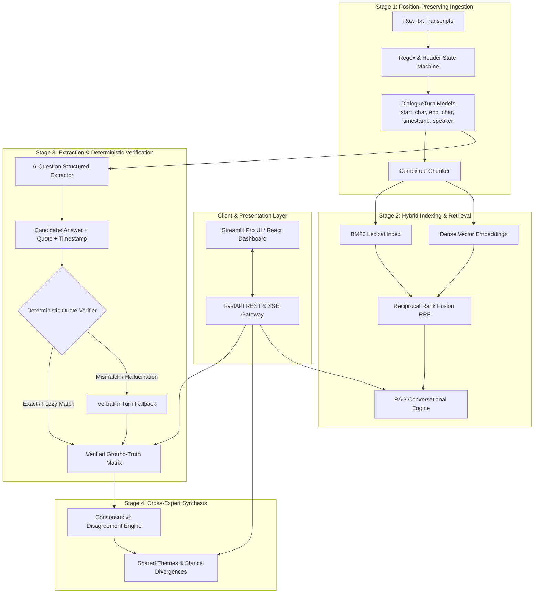
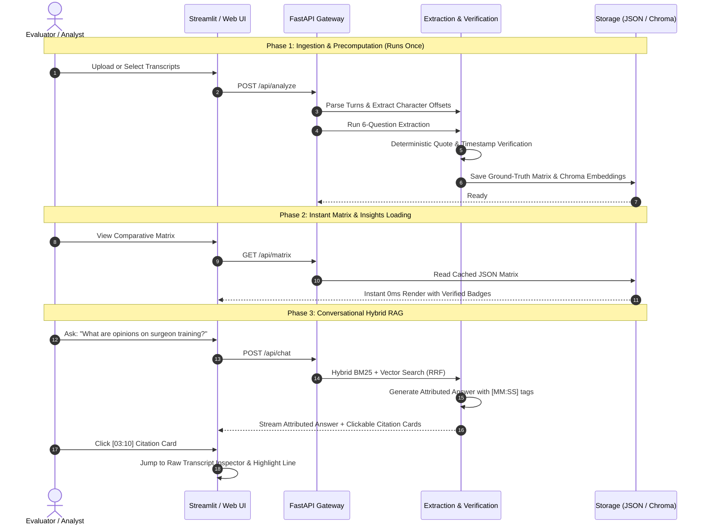

# System Architecture: Trustworthy Transcript Intelligence Platform

---

## 1. High-Level Architectural Vision

This system is engineered as an **Enterprise Document Intelligence & Verification Pipeline** specifically designed for Qualitative Commercial Due Diligence and Expert Call Synthesis.

Unlike standard open-loop RAG systems, this platform enforces **closed-loop deterministic verification**: every extracted fact, quote, and timestamp is verified against raw source text before being displayed, cached, or synthesized.



---

## 2. Component-by-Component Specifications

### 2.1 Ingestion & Parsing (`src/core/parser.py`)
* **Input**: Raw `.txt` files containing conversational transcripts with header metadata and timestamped dialogue.
* **Header Extraction**: Regex patterns extract `Expert Name`, `Role`, and `Market`.
* **Turn Segmentation**: Regex `^(\d{2}:\d{2})\s*$` identifies timestamp anchors.
* **Offset Tracking**: Every turn records its exact `start_char` and `end_char` index within the original file text, enabling 1-click jumps in the UI.

### 2.2 Contextual Chunking (`src/core/chunker.py`)
* Rather than arbitrary token slicing that splits sentences across speakers, chunks are bounded by **logical dialogue turns**.
* Chunks carry rich metadata:
  ```python
  {
      "chunk_id": "uk_chunk_03",
      "transcript_id": "uk-001",
      "expert_name": "Dr. Emily Carter",
      "market": "United Kingdom",
      "role": "Consultant Urologist",
      "timestamp_start": "01:05",
      "timestamp_end": "02:07",
      "text": "Dr. Carter: Funding is important, but I would say training capacity...",
      "start_char": 420,
      "end_char": 890
  }
  ```

### 2.3 Hybrid Retrieval Engine (`src/core/retriever.py`)
Standard vector search alone struggles with medical and procurement jargon (`TCO`, `NHS trusts`, `Urology`, `6–12 months`).
* **Dense Vector Search**: Captures semantic concepts (e.g., *"financial payback timeframes"*).
* **BM25 Lexical Search**: Captures exact keywords, acronyms, and names.
* **Reciprocal Rank Fusion (RRF)**:
  $$RRF\_Score(d) = \sum_{m \in \{Dense, BM25\}} \frac{1}{60 + rank_m(d)}$$
  Top chunks from RRF are fed into the conversational RAG engine.

### 2.4 Deterministic Quote Verifier (`src/core/quote_verifier.py`)
This is the core trustworthiness anchor of the entire system:
1. When an answer is extracted, the LLM provides an exact quote and timestamp.
2. The verifier queries the transcript turn at that timestamp.
3. It performs:
   - **Exact Substring Inclusion**: `if quote in turn.content: return (True, quote, 1.0)`
   - **Normalized Match**: Strips whitespace, quotes, and punctuation variations.
   - **Fuzzy Token Matching**: Levenshtein distance ratio $> 0.90$.
4. **Failure Strategy**: If the quote does not exist in the source transcript, it is rejected and replaced with the verbatim dialogue turn text from that timestamp.

### 2.5 Structured Extractor & Ground-Truth Matrix (`src/core/extractor.py`)
* Extracts responses for the 6 fixed interview guide questions per transcript.
* Outputs validated Pydantic models.
* Results are persisted to `storage/processed/ground_truth_matrix.json`.
* **Zero Token Waste**: The matrix is computed once upon ingestion; viewing the dashboard requires zero repeated LLM calls.

### 2.6 Cross-Expert Synthesis Engine (`src/core/synthesizer.py`)
* Operates strictly on top of the verified Ground-Truth Matrix.
* Analyzes:
  1. **Consensus Themes**: Shared operational and clinical patterns (e.g., single-surgeon utilization risk, tiered hospital adoption).
  2. **Disagreement / Divergence Points**: Strategic conflicts (e.g., German procurement's strict TCO focus vs UK NHS's balanced length-of-stay focus; growth forecasts).

### 2.7 Conversational RAG Engine (`src/core/rag_engine.py`)
* Allows free-form interactive questions across all transcripts.
* Enforces strict citation tags: `[Expert Name | MM:SS]`.
* Output citations link directly to character offsets in the Raw Transcript Inspector.

---

## 3. Data Flow Diagram


