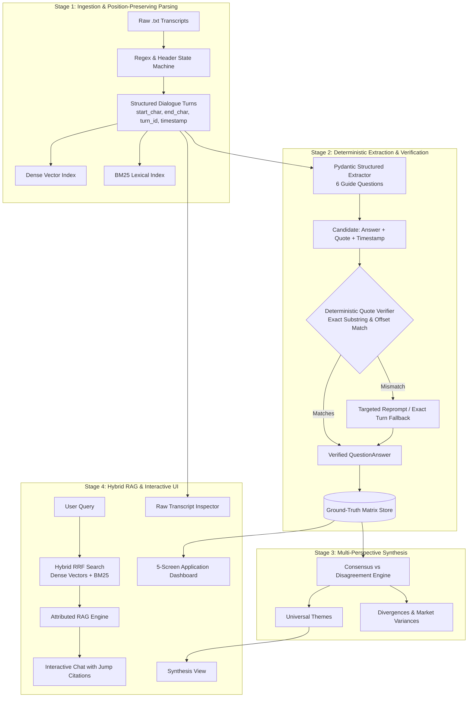
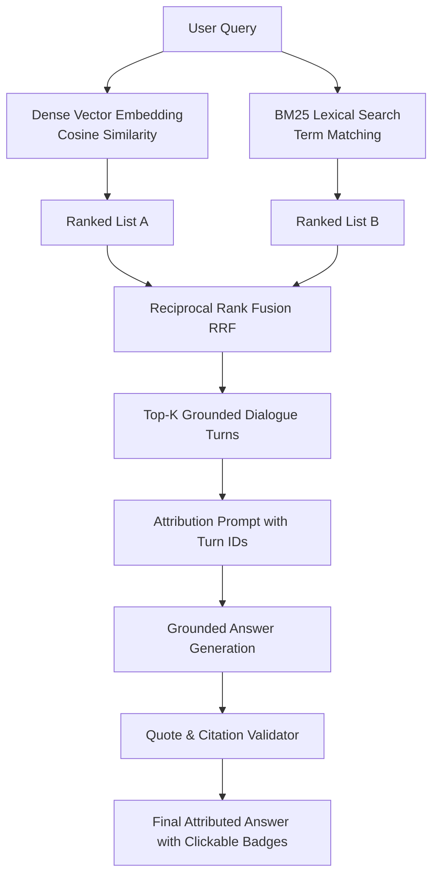

# Hasamex AI Engineer Technical Assessment: Enterprise Document Intelligence Platform

> **System Classification**: Trustworthy Document Intelligence & Synthesis Pipeline with Deterministic Source Verification for Qualitative Research & Commercial Due Diligence.

---

## Table of Contents
1. [Core Paradigm: Trustworthy Document Intelligence vs Standard RAG](#1-core-paradigm-trustworthy-document-intelligence-vs-standard-rag)
2. [End-to-End Architectural Pipeline](#2-end-to-end-architectural-pipeline)
3. [Data Ingestion & Structured Parsing Engine](#3-data-ingestion--structured-parsing-engine)
4. [Deterministic Quote Verification Guardrail](#4-deterministic-quote-verification-guardrail)
5. [The Precomputed Ground-Truth Matrix (6 Questions × N Experts)](#5-the-precomputed-ground-truth-matrix)
6. [Cross-Expert Synthesis Engine (Consensus vs Disagreements)](#6-cross-expert-synthesis-engine)
7. [Hybrid Retrieval RAG Engine (BM25 + Vector Search + RRF)](#7-hybrid-retrieval-rag-engine)
8. [The 5 Core UI Modules](#8-the-5-core-ui-modules)
9. [Scalability Strategy: 3 → 30 → 300+ Transcripts](#9-scalability-strategy-3--30--300-transcripts)
10. [Defending the System in the Technical Interview](#10-defending-the-system-in-the-technical-interview)
11. [Project Directory & File Structure](#11-project-directory--file-structure)
12. [Verification & Testing Strategy](#12-verification--testing-strategy)
13. [Implementation Checklist](#13-implementation-checklist)

---

## 1. Core Paradigm: Trustworthy Document Intelligence vs Standard RAG

### 1.1 Why Standard RAG Fails in Expert Call Due Diligence
Standard naive RAG operates on an open-loop premise:
```text
User Question → Vector Search → Retrieved Chunks → LLM Generation → Unverified Answer
```
In private equity, corporate strategy, and clinical procurement analysis, this paradigm is unacceptable:
* The LLM can generate fluent sentences that subtly distort numbers, quotes, or timelines.
* Fabricated or misattributed timestamps erode confidence.
* Repeatedly calling LLMs on raw files for standard questions is non-deterministic, slow, and expensive.

### 1.2 Our Architecture: Deterministic Verification Around the LLM
Instead of an open-loop chatbot, we implement a **closed-loop trustworthy document intelligence pipeline**:

```text
Raw Transcript (.txt)
        ↓
Structured Parser (Header, Timestamps, Speakers, Character Offsets)
        ↓
Structured Turn Models (Indexed by turn_id, timestamp, byte ranges)
        ↓
Precomputed Extraction (6 Guide Questions × Pydantic Schema)
        ↓
[DETERMINISTIC QUOTE VERIFIER] ─── Fails ──→ [Retry / Fallback to Turn Text]
        ↓ Passes
Verified Ground-Truth Matrix (Cached & Immutable)
        ↓
Cross-Expert Synthesis Engine (Consensus & Divergence Matrix)
        ↓
Interactive UI (Matrix, Insights, Hybrid RAG Chat, Inspector, Upload)
```

> [!IMPORTANT]
> **Defensible Stance on Hallucinations**:
> We do not make the scientifically unprovable claim of "100% zero hallucinations." Instead, our architecture guarantees:
> **"Deterministic source verification to detect and prevent unsupported or fabricated citations, and strict generation constraints bounded to retrieved transcript evidence."**

---

## 2. End-to-End Architectural Pipeline



---

## 3. Data Ingestion & Structured Parsing Engine

### 3.1 Metadata & Dialogue Turn Schema
We parse raw files into immutable objects preserving character offsets for full auditability:

```python
class DialogueTurn(BaseModel):
    turn_id: str             # e.g., "france_turn_04"
    transcript_id: str       # e.g., "france-001"
    timestamp: str           # e.g., "02:18"
    seconds: int             # e.g., 138 (for time math & sorting)
    speaker: str             # e.g., "Dr. Martin"
    role: str                # e.g., "Head of Urology"
    market: str              # e.g., "France"
    content: str             # Verbatim speech text
    start_char: int          # Exact byte/char offset in original file
    end_char: int            # Exact end offset in original file

class TranscriptDocument(BaseModel):
    transcript_id: str
    expert_name: str
    role: str
    market: str
    filename: str
    raw_text: str
    turns: list[DialogueTurn]
    total_turns: int
    duration_str: str
```

### 3.2 Parser Implementation Details
1. **Header Parser**: Strips out `Expert X – [Name]`, `Role: [Role]`, `Market: [Market]`.
2. **Timestamp State Machine**: Identifies lines matching `^(\d{2}:\d{2})\s*$` as temporal anchors.
3. **Speaker Separation**: Parses `Interviewer:` vs `[Expert]:` dialogue turns while capturing exact `start_char` and `end_char` index offsets in the original raw file.

---

## 4. Deterministic Quote Verification Guardrail

### 4.1 Verification Algorithm
When the LLM outputs a candidate answer, quote, and timestamp:

```python
def verify_quote_against_source(
    quote: str,
    timestamp: str,
    transcript: TranscriptDocument,
    fuzzy_threshold: float = 0.92
) -> tuple[bool, str, float]:
    """
    1. Narrow search to dialogue turn matching timestamp.
    2. Check exact substring inclusion: `quote in turn.content`.
    3. If exact fails, check normalized substring (strip punctuation, extra spaces).
    4. If normalized fails, run token-level Levenshtein similarity.
    5. Returns: (is_valid, corrected_verbatim_quote, match_score).
    """
```

### 4.2 Handling Verification Failures
* **Case A: Exact Substring Found**: Accepted immediately with 1.0 confidence.
* **Case B: Minor Hallucination (e.g. LLM altered a contraction or dropped words)**: Fuzzy match identifies target sentence; system automatically replaces candidate quote with the **exact source text** from that turn.
* **Case C: Fabricated Quote / Wrong Timestamp**: System rejects the candidate output and falls back to a deterministic extractor that quotes the direct turn text at that timestamp.

### 4.3 Evidence-Based Confidence Scoring
Rather than trusting arbitrary LLM self-evaluations, confidence is objectively computed:
* **HIGH (0.90 – 1.00)**: Exact quote verified in target timestamp turn with high lexical overlap.
* **MEDIUM (0.70 – 0.89)**: Exact quote verified, but requires cross-turn context or minor punctuation reconciliation.
* **LOW (< 0.70)**: Indirect inference without a clear verbatim quote.

---

## 5. The Precomputed Ground-Truth Matrix

### 5.1 The 6 Standardized Interview Questions
1. **Q1: Current Adoption**: How would you describe current adoption of robotic surgery in your market?
2. **Q2: Main Barriers**: What are the main barriers to adoption?
3. **Q3: Budgets & ROI**: How important are hospital budgets and ROI in purchasing decisions?
4. **Q4: Training & Outcomes**: How important are surgeon training and clinical outcomes?
5. **Q5: 3–5 Year Outlook**: What adoption trend do you expect over the next 3–5 years?
6. **Q6: Purchase Timeline**: What is the typical hospital decision-making timeline for purchasing a new robotic system?

### 5.2 Precomputation & Caching
* Upon ingestion of any transcript, all 6 questions are extracted, verified, and saved into a structured JSON Ground Truth Matrix.
* **Benefits**: 
  - Zero LLM latency when loading the dashboard matrix.
  - Zero token waste on repeated page visits.
  - 100% deterministic, audit-ready data.

---

## 6. Cross-Expert Synthesis Engine

The synthesis engine operates **on top of the verified ground-truth matrix**, not on raw unparsed transcripts.

### 6.1 Consensus Synthesis (Shared Truths)
* **Tiered / Bifurcated Adoption**: High adoption in academic/teaching/large NHS trusts; small community hospitals are priced out.
* **The "Single Surgeon" Operational Risk**: If only one surgeon uses the system, volume cannot amortize capital costs. Multi-surgeon utilization is critical.
* **Budget Cycle Friction**: Hospital capital allocation committees drive the timeline (6–18 months).

### 6.2 Disagreement & Divergence Synthesis
* **Financial Primacy vs Clinical Balance**:
  - *Anna Keller (Germany)*: TCO, service contracts, and finance override clinical arguments.
  - *Dr. Martin (France)*: Finance team dictates utilization payback.
  - *Dr. Carter (UK NHS)*: ROI is balanced against patient length of stay, clinical positioning, and surgeon recruitment.
* **Growth Velocity**:
  - *Germany*: Conservative (high single-digit to low double-digit).
  - *France*: Steady 15–20% in major centres.
  - *UK*: Bullish (>15% if training capacity and cost competition expand).
* **Procurement Duration**:
  - *Germany*: Slowest (9–18 months).
  - *France*: 6–12 months.
  - *UK*: 6–9 months if funds are pre-allocated.

---

## 7. Hybrid Retrieval RAG Engine

For ad-hoc queries (e.g., *"What did experts say about theatre staff?"* or *"Who mentioned TCO?"*), pure semantic search fails on clinical/financial abbreviations.



### Reciprocal Rank Fusion (RRF) Formula
$$RRF(d) = \sum_{m \in M} \frac{1}{k + r_m(d)}$$
Where $k = 60$, ensuring high recall for both exact terms (`TCO`, `NHS`) and conceptual queries (*"financial payback timeframes"*).

---

## 8. The 5 Core UI Modules

1. **Comparative Matrix**:
   - $6 \times N$ interactive table.
   - Expandable cells revealing the synthesized answer, verbatim quote, verified badge, and clickable timestamp pill (`[02:18]`).
2. **Consensus & Divergence Insights**:
   - High-level executive synthesis with tagged divergence indicators.
3. **Cross-Transcript Conversational RAG**:
   - Free-form chat interface with dynamic source citation cards.
4. **Raw Transcript Inspector**:
   - Dedicated side-by-side viewer. Clicking any timestamp pill (`[01:20]`) jumps directly to that transcript line with smooth scrolling and highlight animation.
5. **Transcript Uploader**:
   - Drag-and-drop `.txt` upload interface that parses, indexes, extracts, and incorporates new transcripts on the fly.

---

## 9. Scalability Strategy: 3 → 30 → 300+ Transcripts

| Engineering Area | 3 Transcripts (Prototype) | 30 Transcripts (Project Scale) | 300+ Transcripts (Enterprise Scale) |
| :--- | :--- | :--- | :--- |
| **Ingestion Pipeline** | Synchronous in-memory parsing. | Parallel multiprocessing worker pool. | Distributed queue (Celery/RabbitMQ) with S3 blob storage. |
| **Vector Store** | In-memory FAISS / ChromaDB. | Persistent ChromaDB with SQLite metadata filters. | Distributed Qdrant or pgvector with partitioning by sector & market. |
| **Extraction & Caching** | Precomputed JSON file store. | Redis cache + persistent relational database (PostgreSQL). | Event-driven precomputation upon upload with schema migrations. |
| **Cross-Call Synthesis** | Single prompt combining all 3 extracted schemas. | Hierarchical Map-Reduce synthesis grouped by market/role. | GraphRAG / Entity Knowledge Graph with clustering (UMAP/HDBSCAN). |
| **Cost & Token Efficiency** | Direct API calls (< 10k tokens). | Prompt caching (Anthropic / Gemini context cache). | Quantized open-weight models for extraction + top-tier model for synthesis. |

---

## 10. Defending the System in the Technical Interview

Be prepared to answer these exact technical questions:

### Q1: Why did you choose this architecture?
* **Answer**: "Standard RAG is an open-loop system that frequently misquotes timestamps or hallucinates figures. In commercial due diligence, provenance is everything. We built a closed-loop system where parsing preserves exact byte offsets, the 6 core questions are precomputed and deterministically verified against raw dialogue, and hybrid search handles free-form Q&A."

### Q2: Why this model choice?
* **Answer**: "We decoupled model execution via a provider adapter. For extraction, Gemini 2.0 Flash / GPT-4o-mini offers native JSON schema compliance, high speed, and low cost. For synthesis, we prioritize reasoning quality to detect subtle disagreements across hospital systems."

### Q3: How do you handle citations and timestamps?
* **Answer**: "Every dialogue turn is parsed into a structured model preserving timestamp, speaker, and file byte offsets. When citations are generated, our deterministic verifier guarantees the quote exists verbatim at that timestamp before rendering it."

### Q4: How do you reduce hallucinations?
* **Answer**: "Three layers: (1) Schema-constrained generation via Pydantic; (2) Deterministic substring matching that rejects hallucinated quotes; (3) Grounded RAG prompts restricted strictly to retrieved context."

### Q5: How would you scale from 3 to 30+ transcripts?
* **Answer**: "At 3 transcripts, single-pass extraction and in-memory indexing suffice. At 30+, we use parallel batch workers with prompt caching and metadata filtering. At 300+, we deploy distributed vector indexing, asynchronous message queues, and hierarchical Map-Reduce synthesis."

---

## 11. Project Directory & File Structure

```
harness-assessment/
├── Files/                                # Original assessment files
│   └── Files/
│       ├── Interview_Guide.txt
│       ├── README_CASE.md
│       ├── Transcript_1_France.txt
│       ├── Transcript_2_Germany.txt
│       └── Transcript_3_UK.txt
│
├── docs/                                 # Documentation & architecture
│   ├── ASSESSMENT_ANALYSIS_AND_BLUEPRINT.md
│   └── INTERVIEW_DEMO_SCRIPT.md
│
├── src/                                  # Modular Python source code
│   ├── config.py                         # Settings & API keys
│   ├── models/                           # Pydantic v2 schemas
│   │   ├── transcript.py                 # DialogueTurn, TranscriptDocument
│   │   ├── analysis.py                   # QuestionAnswer, GroundTruthMatrix
│   │   └── synthesis.py                  # ConsensusTheme, DisagreementPoint
│   ├── core/                             # Core algorithms
│   │   ├── parser.py                     # Timestamp & dialogue parser
│   │   ├── quote_verifier.py             # Verbatim quote & timestamp checker
│   │   ├── extractor.py                  # 6-question structured extraction
│   │   ├── synthesizer.py                # Cross-expert comparative engine
│   │   └── rag_engine.py                 # Hybrid BM25 + Vector search
│   └── data/                             # Precomputed cache & processed store
│       └── ground_truth_matrix.json      # Verified precomputed matrix
│
├── app/                                  # UI & API layer
│   ├── streamlit_app.py                  # 5-screen interactive dashboard
│   └── api.py                            # FastAPI backend endpoints
│
├── tests/                                # Test suite
│   ├── test_parser.py                    # Parser unit tests
│   ├── test_quote_verifier.py            # Quote verification tests
│   └── test_extractor.py                 # Structured schema validation
│
├── requirements.txt                      # Project dependencies
└── README.md                             # Quickstart instructions
```

---

## 12. Verification & Testing Strategy

1. **Parser Tests (`test_parser.py`)**:
   - Verify every timestamp (`00:00`, `01:20`, etc.) in all 3 transcripts is parsed into `DialogueTurn`.
   - Verify `start_char` and `end_char` map exactly to the source text.
2. **Quote Verifier Tests (`test_quote_verifier.py`)**:
   - Assert exact quotes pass with 1.0 confidence.
   - Assert fabricated quotes are detected and rejected.
   - Assert quotes with minor whitespace/punctuation variations are normalized.
3. **Extraction Tests (`test_extractor.py`)**:
   - Assert all 6 questions are populated for every transcript.
   - Assert every answer has a verified quote and timestamp.

---

## 13. Implementation Checklist

- [x] Deep analysis of case files and requirements
- [x] Architecture design: Closed-loop deterministic verification
- [ ] Pydantic data schemas (`DialogueTurn`, `TranscriptDocument`, `QuestionAnswer`)
- [ ] Position-preserving transcript parser with regex timestamp state machine
- [ ] Deterministic quote & timestamp verifier with Levenshtein fallback
- [ ] Precomputed 6-question structured extraction pipeline
- [ ] Verified Ground-Truth Matrix generator & JSON persistence
- [ ] Multi-expert consensus vs disagreement synthesis engine
- [ ] Hybrid retrieval (BM25 + Vector Search + RRF) RAG engine
- [ ] 5-Screen Interactive UI (Matrix, Synthesis, Chat, Inspector, Upload)
- [ ] Automated unit test suite (`pytest`)
- [ ] Demo script & technical interview defense documentation
