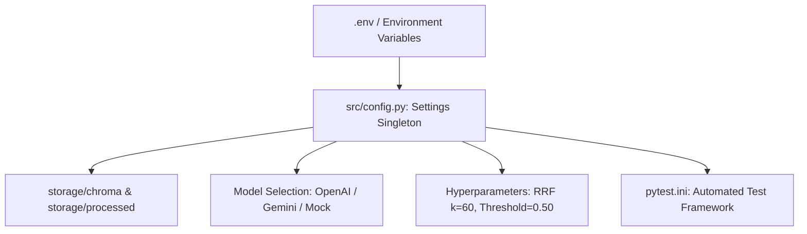

# Phase 0: Environment, Configuration & Provider Foundation

**Document**: `docs/PHASE0.md`  
**Phase Objective**: Establish the central runtime configuration, environment variables, offline/live provider toggles, vector store paths, and testing foundation.  
**Deliverable Files**:
1. `docs/PHASE0.md` (This Specification)
2. `src/config.py` (Centralized Settings Engine)
3. `.env.example` (Template Configuration)
4. `pytest.ini` (Root Pytest Configuration)

---

## 1. Architectural Role of Phase 0

Phase 0 provides the **operational backbone** for all downstream pipeline stages (Phases 1 through 8).



### Key Principles
1. **Single Source of Truth**: All environment variables, directory paths, model names, and retrieval hyperparameters are accessed exclusively through `src.config.settings`.
2. **Offline-First & Reviewer-Friendly**: The system supports deterministic `mock` providers for extraction, synthesis, and embeddings so evaluators can run the entire test suite and dashboard without requiring an external paid API key.
3. **Directory Auto-Creation**: Storage directories (`storage/chroma`, `storage/processed`) are created automatically if they do not exist.

---

## 2. Configuration Parameters & Hyperparameters

| Parameter | Type | Default Value | Description |
| :--- | :--- | :--- | :--- |
| `openai_api_key` | `str` | `""` | OpenAI API Key for live extraction, synthesis, and RAG. |
| `google_api_key` | `str` | `""` | Google Gemini API Key. |
| `app_env` | `str` | `"development"` | Application environment (`development` / `production`). |
| `app_host` | `str` | `"0.0.0.0"` | Host binding for API/App. |
| `app_port` | `int` | `8000` | Port binding for API/App. |
| `llm_model` | `str` | `"gpt-4o-mini"` | Target LLM model for extraction, synthesis, and Q&A. |
| `embedding_model` | `str` | `"all-MiniLM-L6-v2"` | Sentence-Transformers embedding model. |
| `llm_temperature`| `float` | `0.0` | Zero temperature for deterministic extraction. |
| `vector_store_path` | `Path` | `./storage/chroma` | Persistence directory for ChromaDB vector index. |
| `processed_data_path` | `Path`| `./storage/processed`| Storage directory for cached JSON artifacts. |
| `data_dir` | `Path` | `./data` | Read-only raw transcript and guide directory. |
| `rrf_k` | `int` | `60` | Reciprocal Rank Fusion constant for combining BM25 and vector ranks. |
| `evidence_gate_threshold` | `float` | `0.50` | Fused relevance score cutoff for Evidence Gate abstention. |
| `top_k_chunks` | `int` | `8` | Number of top fused chunks to retrieve for Q&A. |
| `max_evidence_chunks` | `int` | `4` | Maximum expert turns passed into the final LLM prompt. |

---

## 3. Directory Layout Requirements

```text
harness-assessment/
├── .env.example
├── pytest.ini
├── requirements.txt
├── data/
├── storage/
│   ├── chroma/
│   └── processed/
└── src/
    └── config.py
```

---

## 4. Verification Invariants

1. `from src.config import settings` imports cleanly in any module.
2. Calling `settings.processed_data_path.exists()` returns `True`.
3. `pytest` executes from the root directory without `PYTHONPATH` configuration issues.
