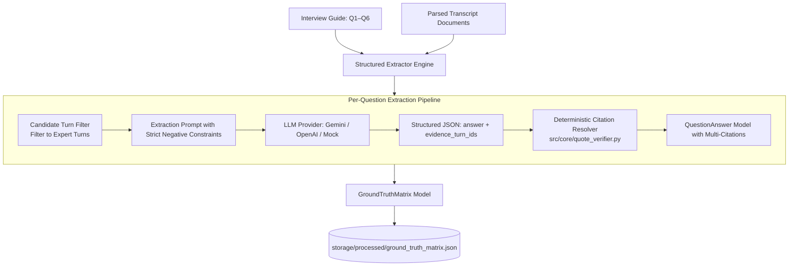

# Phase 3: Structured Extraction & Precomputed Ground-Truth Matrix

**Document**: `docs/PHASE3.md`  
**Phase Objective**: Extract structured, grounded answers to the 6 standardized interview guide questions across all expert transcripts, resolve citations deterministically, and cache the $6 \times 3$ Ground-Truth Matrix to disk with cache versioning.  
**Deliverable Files**:
1. `src/prompts/extraction.py` (Versioned system & user prompt templates)
2. `src/core/extractor.py` (Structured extraction pipeline with deterministic resolution & cache)
3. `storage/processed/ground_truth_matrix.json` (Precomputed cache)
4. `tests/test_extractor.py` (Automated extraction & matrix unit tests)

---

## 1. Architectural Role of Phase 3

Phase 3 transitions from raw text parsing to **structured diligence intelligence**:



### Key Principles
1. **Evidence IDs as Primary Contract**: The LLM outputs `answer` and `evidence_turn_ids: list[str]`. The backend looks up the immutable `DialogueTurn` to extract the verbatim source quotes and character coordinates.
2. **Multi-Citation Support**: An answer can reference multiple timestamps (e.g. UK on ROI citing both `02:07` and `03:10`).
3. **Precomputed Caching with Versioning**:
   - The matrix is computed once upon ingestion.
   - Cached JSON records `source_hashes`, `prompt_version`, `model_name`, and `generated_at`.
   - On subsequent runs, if source hashes match, the matrix loads instantly in 0ms without consuming LLM tokens.
4. **Mock / Offline Fallback**: Includes deterministic extraction fixtures so reviewers can run the test suite and evaluate the matrix without configuring an external API key.

---

## 2. Pydantic Data Contracts

### 2.1 Structured LLM Extraction Response
```python
class RawLLMQuestionExtraction(BaseModel):
    """Raw structured output schema enforced on LLM generation."""
    question_id: str
    answer: str
    evidence_turn_ids: list[str]
    candidate_quote: str | None = None
    confidence: Literal["HIGH", "MEDIUM", "LOW", "INSUFFICIENT"] = "HIGH"
```

### 2.2 GroundTruthMatrix Schema
```python
class GroundTruthMatrix(BaseModel):
    project_title: str = "European Robotic Surgery Market"
    generated_at: str
    prompt_version: str = "v1.0"
    model_name: str = "gpt-4o-mini"
    source_hashes: dict[str, str]  # transcript_id -> SHA256
    questions: list[InterviewQuestion]
    experts: list[ExpertAnalysis]
```

---

## 3. The 6 Standard Questions Ground Truth

| Question | France (Dr. Jean Martin) | Germany (Anna Keller) | UK (Dr. Emily Carter) |
| :--- | :--- | :--- | :--- |
| **Q1: Adoption** | Concentrated in large academic & private centres; regional slow.<br>*(Turn: `00:18`)* | Uneven; university hospitals lead, regional waiting.<br>*(Turn: `00:16`)* | Standard for selected procedures in large NHS trusts; varies by trust.<br>*(Turn: `00:14`)* |
| **Q2: Barriers** | Capital budget approval and needing strong economic case.<br>*(Turn: `01:20`)* | High capital cost and proving high enough volume.<br>*(Turn: `01:10`)* | Funding is key, but training capacity is equally critical.<br>*(Turn: `01:05`)* |
| **Q3: Budgets & ROI** | Finance team requires utilization, procedure volume, and payback modeling.<br>*(Turn: `02:18`)* | TCO, service contracts, and economic justification decide approval.<br>*(Turn: `02:08`)* | Balanced: ROI matters, but length of stay and clinical strategy weigh equally.<br>*(Turns: `02:07`, `03:10`)* |
| **Q4: Training** | Multi-surgeon training vital in year 1 to drive utilization.<br>*(Turn: `03:10`, `04:08`)* | Having only one trained surgeon destroys the economic business case.<br>*(Turn: `03:05`)* | Holistic training (surgeons + theatre staff) is the sustainability factor.<br>*(Turn: `01:05`, `06:04`)* |
| **Q5: Trend Outlook** | Steady 15–20% annual procedure growth in top centres.<br>*(Turn: `05:07`)* | Conservative growth: high single digits or low double digits.<br>*(Turn: `04:09`, `05:08`)* | Bullish / accelerating (>15% growth if training expands and costs fall).<br>*(Turn: `04:06`)* |
| **Q6: Timeline** | 6 to 12 months once serious; longer if budget cycle deferred.<br>*(Turn: `06:08`)* | 9 to 18 months due to multi-stakeholder alignment.<br>*(Turn: `06:05`)* | 6 to 9 months if funds pre-allocated; longer for NHS capital cycles.<br>*(Turn: `05:04`)* |

---

## 4. Automated Test Specification (`tests/test_extractor.py`)

1. **`test_matrix_dimensions()`**:
   - Asserts matrix contains all 3 experts (France, Germany, UK).
   - Asserts each expert contains all 6 answers (18 total answers).
2. **`test_matrix_citation_provenance()`**:
   - Loops through all 18 answers.
   - Asserts every answer has at least one citation (`len(citations) >= 1`).
   - Asserts every citation has `evidence_status in [EXACT_VERIFIED, NORMALIZED_VERIFIED]`.
   - Asserts citation timestamps match target turn timestamps.
3. **`test_cache_idempotency()`**:
   - Asserts second call to `build_or_load_matrix()` returns cached instance in 0ms without re-running extraction.
