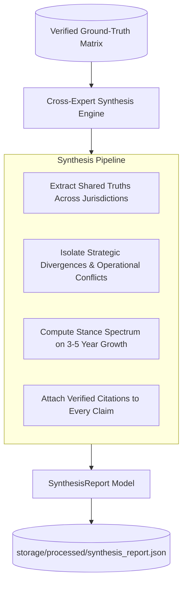

# Phase 4: Cross-Expert Synthesis Engine (Consensus, Disagreements & Stance Spectrum)

**Document**: `docs/PHASE4.md`  
**Phase Objective**: Synthesize high-level commercial diligence insights strictly from the precomputed, verified `GroundTruthMatrix`, generating auditable consensus themes, strategic divergences, and a directional market growth spectrum.  
**Deliverable Files**:
1. `src/models/synthesis.py` (Domain Schemas with Citation Provenance)
2. `src/prompts/synthesis.py` (Comparative Synthesis Prompts)
3. `src/core/synthesizer.py` (Synthesis Engine with Deterministic Fallback & Cache)
4. `storage/processed/synthesis_report.json` (Precomputed Cache)
5. `tests/test_synthesizer.py` (Unit Test Suite)

---

## 1. Architectural Role of Phase 4

Phase 4 delivers the **executive intelligence layer** of the commercial diligence platform.



### Key Architectural Invariants
1. **Source-of-Truth Separation**: Synthesis runs **only on verified matrix answers**, not on raw unparsed text. This prevents the LLM from hallucinating new facts at the synthesis stage.
2. **Provenance on Every Claim**: Every consensus theme and disagreement point carries **direct citation links** (`QuoteCitation`) back to the specific expert dialogue turns.
3. **Targeted Stance Spectrum**: Directional spectra are applied strictly where meaningful (e.g., 3–5 Year Growth Outlook: Conservative $\leftrightarrow$ Moderate $\leftrightarrow$ Bullish), rather than force-fitted to non-directional questions.

---

## 2. Pydantic Data Models (`src/models/synthesis.py`)

```python
class ConsensusTheme(BaseModel):
    """A shared operational or clinical truth agreed upon across multiple markets."""
    theme_id: str
    title: str
    summary: str
    citations: list[QuoteCitation] = Field(default_factory=list)


class DisagreementPoint(BaseModel):
    """A strategic conflict or jurisdictional variance across experts."""
    point_id: str
    topic: str
    summary: str
    stances: dict[str, str]  # e.g. {"Germany": "Strict TCO...", "UK": "Balanced..."}
    citations: list[QuoteCitation] = Field(default_factory=list)


class GrowthSpectrumEntry(BaseModel):
    """An expert's position on the 3-5 year adoption growth spectrum."""
    expert_name: str
    market: str
    stance: Literal["CONSERVATIVE", "MODERATE", "BULLISH"]
    summary: str
    citations: list[QuoteCitation] = Field(default_factory=list)


class SynthesisReport(BaseModel):
    """Executive synthesis report containing consensus, disagreements, and growth spectrum."""
    report_version: str = "synthesis_v1"
    generated_at: str
    prompt_version: str = "v1.0"
    model_name: str
    consensus_themes: list[ConsensusTheme]
    disagreements: list[DisagreementPoint]
    growth_spectrum: list[GrowthSpectrumEntry]
```

---

## 3. Ground Truth Synthesis Mapping

### 3.1 Shared Consensus Themes
1. **The "Single-Surgeon" Utilization Hazard**:
   - *France*: Multiple surgeons needed in year 1 to make economics viable (`03:10`).
   - *Germany*: One surgeon using system destroys business case (`03:05`).
   - *UK*: Training surgeons and theatre staff is vital for sustainable programs (`01:05`, `06:04`).
2. **Tiered / Bifurcated Hospital Adoption**:
   - Academic, university, and large NHS trusts are standardizing robotic systems; smaller regional community hospitals lag due to capital barriers (`00:18`, `00:16`, `00:14`).
3. **Capital Budget Cycle Dependency**:
   - Purchase decisions are tied to annual hospital budget allocation windows (6–18 months).

### 3.2 Key Disagreements & Jurisdictional Divergences
1. **Financial Primacy vs. Clinical Strategy**:
   - *Anna Keller (Germany)*: TCO, service contracts, and finance override clinical interest (`02:08`).
   - *Dr. Martin (France)*: Finance team dictates utilization and payback (`02:18`).
   - *Dr. Carter (UK NHS)*: ROI is balanced with length of stay, clinical position, and surgeon recruitment (`02:07`, `03:10`).
2. **Growth Rate Velocity**:
   - *Germany*: Conservative high single-digit / low double-digit (`04:09`, `05:08`).
   - *France*: Steady 15–20% in top centres (`05:07`).
   - *UK*: Bullish >15% if training capacity and cost competition expand (`04:06`).
3. **Procurement Timeline Duration**:
   - *Germany*: 9–18 months due to procurement/clinical alignment (`06:05`).
   - *France*: 6–12 months (`06:08`).
   - *UK*: 6–9 months if funds are pre-allocated (`05:04`).

---

## 4. Automated Test Specification (`tests/test_synthesizer.py`)

1. **`test_synthesis_generation()`**:
   - Generates report from GroundTruthMatrix.
   - Asserts at least 2 consensus themes and at least 2 disagreement points.
   - Asserts growth spectrum contains all 3 experts (France, Germany, UK).
2. **`test_synthesis_citation_integrity()`**:
   - Asserts every consensus theme and disagreement point has valid citations (`len(citations) >= 1`).
   - Asserts all citations point to valid turns and contain non-empty verbatim quotes.
3. **`test_synthesis_cache_idempotency()`**:
   - Asserts cached report loads in 0ms without re-generating when inputs are unchanged.
