# Scalability Strategy: Scaling from 3 to 30 to 300+ Transcripts

---

## 1. Executive Summary

A critical interview requirement is demonstrating a credible engineering roadmap for scaling this application from **3 prototype transcripts** to **30 project transcripts** and **300+ enterprise-scale transcripts**.

This document outlines the changes across data ingestion, storage, retrieval, context management, and cost/latency optimization.

---

## 2. Multi-Tier Scaling Matrix

| Engineering Dimension | Tier 1: Prototype (3 Transcripts) | Tier 2: Project Scale (30 Transcripts) | Tier 3: Enterprise Platform (300+ Transcripts) |
| :--- | :--- | :--- | :--- |
| **Total Volume** | ~6,000 words (~8,000 tokens) | ~60,000 words (~80,000 tokens) | ~600,000+ words (~800k–2M tokens) |
| **Ingestion Pipeline** | Synchronous, in-memory regex parsing. | Multiprocessing batch workers; async Celery tasks. | Distributed event-driven ingestion (Kafka/SQS + Celery workers) with automated audio/transcript OCR pipeline. |
| **Structured Extraction** | Direct sequential LLM extraction of 6 questions. | Parallel extraction via worker pool with schema validation & retry queues. | Distributed map-reduce extraction workers; precomputed question templates per sector/specialty. |
| **Storage & Persistence** | Local JSON files (`storage/processed/`). | SQLite / PostgreSQL relational DB + Redis cache. | Distributed PostgreSQL (Supabase/AWS RDS) + S3 blob storage + Redis cluster. |
| **Vector Store & Indexing** | In-memory ChromaDB / FAISS. | Persistent ChromaDB / pgvector with metadata filters (`market`, `role`, `date`). | Distributed Qdrant or Pinecone cluster with partitioned indexes and namespace isolation. |
| **Retrieval Mechanism** | In-memory BM25 + Dense vector search. | Hybrid BM25 + Vector Search with Reciprocal Rank Fusion (RRF) and Cohere Rerank. | Multi-stage retrieval: Metadata pre-filtering $\rightarrow$ Hybrid RRF $\rightarrow$ Cross-encoder reranker $\rightarrow$ Contextual compression. |
| **Cross-Call Synthesis** | Single prompt combining all 3 extracted records. | Hierarchical Map-Reduce synthesis grouped by country/specialty. | GraphRAG / Entity-oriented Knowledge Graph with automated stance clustering (UMAP/HDBSCAN). |
| **Context & Token Optimization** | Full context fits in a standard context window. | Prompt Caching (Anthropic prompt cache / Gemini context cache) with >80% hit rates. | Dynamic context window assembly: selective injection of pre-verified structured facts rather than raw transcripts. |
| **Cost & Latency** | Direct API calls (< $0.05 per run). | Batch API calls for overnight runs; sub-$1.00 per project. | Fine-tuned SLMs (e.g. Llama 3 8B / Mistral) for extraction + frontier model for synthesis. Target cost < $0.01/transcript. |

---

## 3. Detailed Architectural Evolution

```mermaid
graph TD
    subgraph Tier1 ["Tier 1: 3 Transcripts (Case Scale)"]
        T1_Files[3 Text Files] --> T1_Parse[In-Memory Parser]
        T1_Parse --> T1_Matrix[Static JSON Matrix]
        T1_Parse --> T1_Chroma[Local ChromaDB]
    end

    subgraph Tier2 ["Tier 2: 30 Transcripts (Project Scale)"]
        T2_Files[30 Transcripts] --> T2_Async[Async Celery Queue]
        T2_Async --> T2_Extract[Parallel Worker Pool]
        T2_Extract --> T2_Cache[Redis Cache + Postgres]
        T2_Extract --> T2_PGVector[pgvector Hybrid Index]
        T2_Cache --> T2_HierSynth[Hierarchical Map-Reduce Synthesis]
    end

    subgraph Tier3 ["Tier 3: 300+ Transcripts (Enterprise Scale)"]
        T3_Files[300+ Audio & Transcripts] --> T3_Kafka[Kafka / SQS Event Bus]
        T3_Kafka --> T3_Cluster[Auto-scaling Kubernetes Workers]
        T3_Cluster --> T3_KG[GraphRAG / Knowledge Graph]
        T3_Cluster --> T3_Qdrant[Distributed Qdrant Vector Cluster]
        T3_KG --> T3_ClusterAnalysis[Automated Outlier & Consensus Clustering]
    end
```

### 3.1 Tier 2: Scaling to 30 Transcripts (The Real Consulting Project Scale)
In a typical private equity diligence engagement, an analyst conducts 20–30 expert calls.
1. **Parallel Extraction Worker Pool**: Instead of running 30 extractions sequentially (which would take minutes), transcripts are processed concurrently via Python `asyncio` or Celery workers.
2. **Metadata Filtering**: Analysts rarely search all 30 calls at once. The vector store filters by:
   - Market: `France`, `Germany`, `UK`, `Nordics`
   - Role: `Clinician / Surgeon` vs `Procurement Director` vs `Hospital CEO`
3. **Hierarchical Synthesis**:
   - Step 1 (Map): Summarize opinions per country/cohort.
   - Step 2 (Reduce): Synthesize cohort findings into pan-European insights.

### 3.2 Tier 3: Scaling to 300+ Transcripts (The Expert Network Scale)
At platforms like Tegus or AlphaSights:
1. **Event-Driven Microservices**: Transcripts arrive via webhooks or audio uploads; ingestion is decoupled from the user-facing web app.
2. **Precomputed Entity Graph**: Rather than naive text chunking, medical systems (e.g. Da Vinci, Hugo, Senhance), hospitals, and key pricing metrics are extracted into a structured graph database (Neo4j).
3. **Automated Consensus Clustering**: Algorithms like UMAP + HDBSCAN cluster expert opinions on a 2D map, automatically highlighting consensus clusters and outlier contrarian views.
